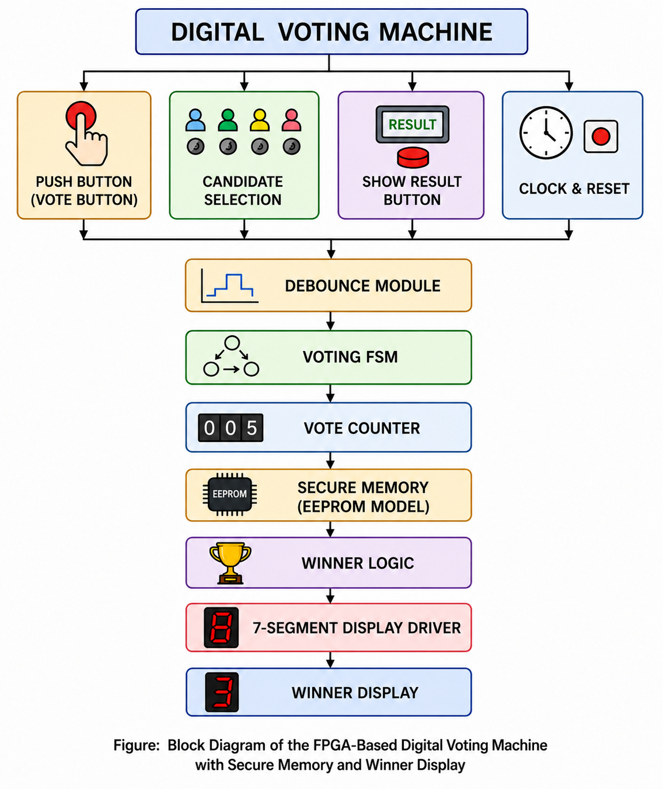
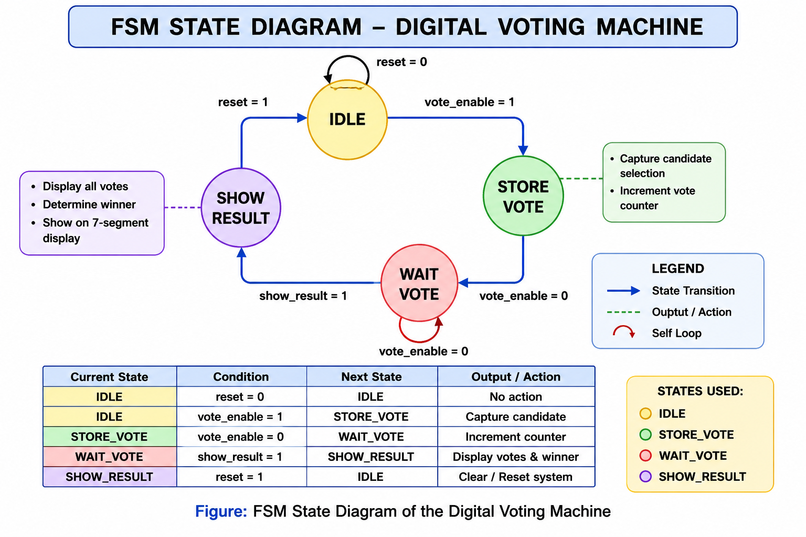
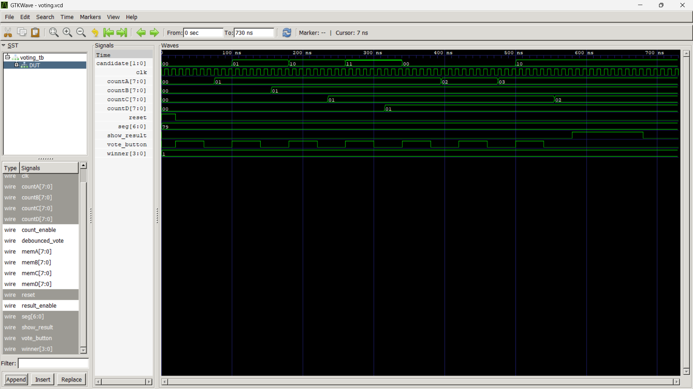

# 🗳️ FPGA-Based Digital Voting Machine with Secure Memory


<p align="center">
  
</p>

---

# 📖 Project Overview

This project presents an **FPGA-Based Digital Voting Machine** designed using **Verilog HDL**. The system allows voting for four candidates, securely stores vote counts using a simulated **EEPROM/Flash memory model**, determines the winning candidate using dedicated winner logic, and displays the winner on a **7-Segment Display**.

The design follows a modular architecture based on a **Finite State Machine (FSM)** and is verified through functional simulation using **Icarus Verilog** and **GTKWave**.

---

# 📌 Project Status

- ✅ RTL Design Completed
- ✅ Testbench Developed
- ✅ Functional Simulation Verified
- ✅ GTKWave Waveform Generated
- ✅ Documentation Completed
- ✅ GitHub Repository Published

---

# 📋 Project Specifications

| Specification | Details |
|--------------|---------|
| Design Language | Verilog HDL |
| Platform | FPGA |
| Candidates Supported | 4 |
| Controller | Finite State Machine (FSM) |
| Vote Storage | EEPROM/Flash Memory Model |
| Display | 7-Segment Display |
| Verification | Testbench Simulation |
| Simulator | Icarus Verilog |
| Waveform Viewer | GTKWave |

---

# ✨ Features

- FPGA-Based Digital Voting Machine
- Finite State Machine (FSM) Control
- Four-Candidate Voting System
- Push Button Debouncing
- Secure EEPROM/Flash Memory Simulation
- Individual Vote Counters
- Automatic Winner Detection
- 7-Segment Display Driver
- Modular Verilog HDL Design
- Functional Simulation and Waveform Verification

---

# 🏗️ System Architecture

<p align="center">

</p>

---

# 📊 Block Diagram

<p align="center">

</p>

---

# 🔄 FSM State Diagram

<p align="center">

</p>

---

# ⚙️ Working Principle

1. The voter selects one of the four candidates.
2. The Vote Button is pressed.
3. The Debounce Module removes switch bouncing.
4. The FSM validates the vote request.
5. The Vote Counter increments the selected candidate's vote.
6. The updated vote count is stored in the Secure Memory module.
7. When the **Show Result** button is pressed, the Winner Logic compares all vote counts.
8. The winning candidate ID is displayed on the **7-Segment Display**.

---

# 🧩 RTL Modules

| Module | Function |
|----------|----------|
| debounce.v | Removes switch bounce from the vote button |
| vote_fsm.v | Controls the voting sequence using an FSM |
| vote_counter.v | Maintains vote counts for each candidate |
| secure_memory.v | Simulates EEPROM/Flash memory storage |
| winner_logic.v | Determines the candidate with the highest votes |
| seven_segment.v | Drives the 7-Segment Display |
| top.v | Integrates all modules into the complete system |

---

# 📁 Project Structure

```text
Digital-Voting-Machine
│
├── README.md
├── LICENSE
├── .gitignore
│
├── RTL
│   ├── debounce.v
│   ├── vote_counter.v
│   ├── vote_fsm.v
│   ├── secure_memory.v
│   ├── winner_logic.v
│   ├── seven_segment.v
│   └── top.v
│
├── TB
│   └── voting_tb.v
│
├── DOCS
│   ├── 01_Project_Requirements.docx
│   ├── 02_Block_Diagram.docx
│   ├── 03_FSM_Diagram.docx
│   ├── 04_State_Encoding_Table.docx
│   ├── 05_State_Transition_Table.docx
│   ├── 06_System_Architecture.docx
│   └── 07_Test_Plan.docx
│
├── IMAGES
│   ├── architecture.png
│   ├── block_diagram.png
│   ├── fsm_diagram.png
│   └── waveform.png
│
└── WAVEFORMS
    └── voting.vcd
```

---

# 📈 Simulation Results

The complete design was verified using **Icarus Verilog**.

Simulation successfully demonstrated:

- Correct vote counting
- Proper FSM state transitions
- Debounce functionality
- Secure vote storage
- Winner determination
- Correct 7-Segment display output

---

# 📷 Simulation Waveform

<p align="center">

</p>

---

# 🛠️ Technologies Used

- Verilog HDL
- FPGA Digital Design
- Finite State Machine (FSM)
- Icarus Verilog
- GTKWave
- Visual Studio Code

---

# ▶️ Running the Simulation

### Compile

```bash
iverilog -g2012 -o voting_sim RTL/*.v TB/voting_tb.v
```

### Run

```bash
vvp voting_sim
```

### Open Waveform

```bash
gtkwave voting.vcd
```

---

# 🎯 Applications

- Electronic Voting Systems
- FPGA Learning Projects
- Digital Logic Design
- Embedded Systems Education
- Academic Mini Projects

---

# 🚀 Future Enhancements

- LCD/OLED Display Interface
- Biometric Voter Authentication
- Password-Protected Administrator Mode
- External EEPROM Integration
- FPGA Board Implementation
- Vote Encryption
- Remote Result Monitoring

---

# 👨‍💻 Author

**Seela Rupesh**

B.Tech – Electronics and Communication Engineering

Pragati Engineering College

- GitHub: https://github.com/SEELARUPESH
- LinkedIn: https://www.linkedin.com/in/seela-rupesh-168a712b8

---

# 📄 License

This project is licensed under the **MIT License**.

---

## ⭐ Support

If you found this project useful or learned something from it, consider giving this repository a **Star ⭐**.
